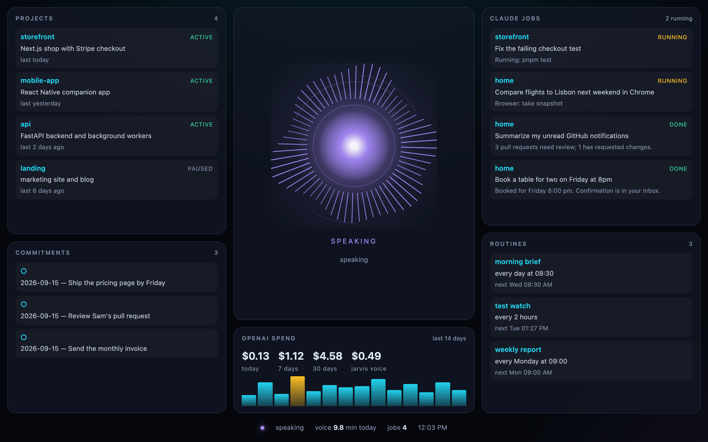

# Hey Jarvis

**The voice assistant that actually runs your Mac.**



Say **"Hey Jarvis"** and just talk. Jarvis answers instantly in a natural voice and gets the work done with [Claude Code](https://claude.com/claude-code): your browser, your apps, your files, your code, your inbox. Keep talking while it works; it tells you out loud when each job is done.

## What it can do

- **🌐 Your browser.** Drives your real, logged-in Chrome: searches, clicks, fills forms, books tables, compares flights, checks dashboards, reads any site you're signed in to.
- **💻 Your code.** Builds features, fixes bugs, runs tests, commits and opens pull requests in any of your projects, several at once.
- **📬 Email, calendar, docs.** Reads and drafts email, checks your calendar, searches Drive, through your Claude connectors (Gmail, Google Calendar, Drive, Vercel, …).
- **🖥 Your whole Mac.** Opens and controls any app, runs shell commands and AppleScript, finds and organizes files, changes settings.
- **⏰ Routines.** "Every morning at 8:30, brief me on email, calendar and pull requests." Scheduled work that runs on its own and reports by voice.
- **🧠 Memory.** Remembers what you tell it about you and your projects, in every conversation.
- **🗣 Any language.** English by default. Switch languages mid-sentence and Jarvis follows you.
- **📊 Live panel.** Running jobs, routines, projects and spend at a glance.
- **📱 Anywhere.** Job results reach you on Telegram when you step away.
- **✅ You decide the big moves.** Before it pushes to main, deploys, sends a message or pays, Jarvis asks, and a spoken "yes" is all it takes.

## Just say it

- "Hey Jarvis, in storefront, fix the failing checkout test."
- "Book a table for two on Friday at 8."
- "Which of my pull requests have new comments?"
- "Find flights to Lisbon next weekend under 200 euros."
- "Clean up my Downloads folder."
- "Every Monday at 9, summarize last week's commits and deploys."
- "Remember that I prefer pnpm over npm."
- "What are you working on?" · "Stop that job."

## Get started

You need a Mac, [uv](https://docs.astral.sh/uv/) (`brew install uv`), [Claude Code](https://claude.com/claude-code) installed and logged in, and a [Gemini API key](https://aistudio.google.com/apikey) or an [OpenAI API key](https://platform.openai.com/api-keys).

```bash
git clone https://github.com/dijiclick/hey-jarvis.git
cd hey-jarvis
uv sync
uv run jarvis setup      # voice engine, API key, language, projects folder
uv run jarvis app        # builds Jarvis.app
```

Double-click **Jarvis.app** and say "Hey Jarvis". It lives in your menu bar. The first time, allow **Microphone**, and add Jarvis under **Accessibility** so the ⌃⌥J hotkey works. For browser control, open `chrome://inspect/#remote-debugging` in Chrome and switch remote debugging on.

**Cost:** voice runs about 2¢ a minute on Gemini Live. Claude Code runs on your existing Claude subscription.

## How it works

```
"Hey Jarvis" / ⌃⌥J ─► wake word, on-device (openWakeWord)
                              │
                              ▼
                  Real-time voice: Gemini Live or OpenAI GPT-Live
                              │  ask_claude · job_status · cancel_job · remember · routines
                              ▼
                  Claude Code (Agent SDK), one session per project
                  shell · AppleScript · any app · files · logged-in Chrome · your connectors
                              │
                              ▼
                  Spoken report + macOS notification (+ Telegram when you're away)
```

## Commands

```bash
uv run jarvis setup              # configure voice, key, language, projects folder
uv run jarvis doctor             # check keys, microphone, Claude Code, wake word
uv run jarvis app                # build Jarvis.app
uv run jarvis panel              # open the live panel
uv run jarvis routines           # list scheduled routines
uv run jarvis report             # voice minutes and cost
uv run jarvis install            # start at login (`jarvis uninstall` removes it)
uv run jarvis run --no-menubar   # run in the terminal
```

## Configuration

`jarvis setup` writes `~/.jarvis/.env` for you. Everything else is optional (see [`.env.example`](.env.example)):

| Setting | Default | |
|---|---|---|
| `GEMINI_API_KEY` / `OPENAI_API_KEY` | | At least one. With both, Gemini is used. |
| `JARVIS_VOICE_PROVIDER` | `gemini` | `gemini` or `openai` |
| `JARVIS_DEFAULT_LANGUAGE` | `English` | The language Jarvis starts every conversation in |
| `JARVIS_PROJECTS_ROOT` | `~/Projects` | Where your projects live |
| `JARVIS_GEMINI_VOICE` | `Enceladus` | Also `Charon`, `Puck`, `Kore`, `Fenrir`, … |
| `JARVIS_VOICE` | `cinder` | OpenAI voice: `cinder`, `stone`, `beacon`, `vesper`, `marin` |
| `JARVIS_HOTKEY` | `<ctrl>+<alt>+j` | |
| `JARVIS_INPUT_DEVICE` | `auto` | `auto` uses the macOS input; or part of a device name, e.g. `macbook` |
| `JARVIS_WAKE_THRESHOLD` | `0.5` | Raise it if Jarvis wakes by mistake |
| `TELEGRAM_BOT_TOKEN` / `TELEGRAM_CHAT_ID` | | Job reports on Telegram |

Nicknames for projects go in `~/.jarvis/projects.json`, e.g. `{"the store": "storefront"}`.

## Troubleshooting

- **It doesn't wake up.** Run `uv run jarvis doctor`. Bluetooth headsets sometimes give macOS a silent mic; Jarvis switches away on its own, or set `JARVIS_INPUT_DEVICE=macbook`.
- **The hotkey does nothing.** Add Jarvis.app under System Settings › Privacy & Security › Accessibility.
- Logs: `~/.jarvis/jarvis.log`.

## Development

```bash
uv run pytest                                  # unit tests
JARVIS_SLOW=1 uv run pytest                    # plus real Claude and wake-model tests
bash tests/e2e/run_e2e.sh                      # real voice runs in a throwaway sandbox
```

## License

MIT
